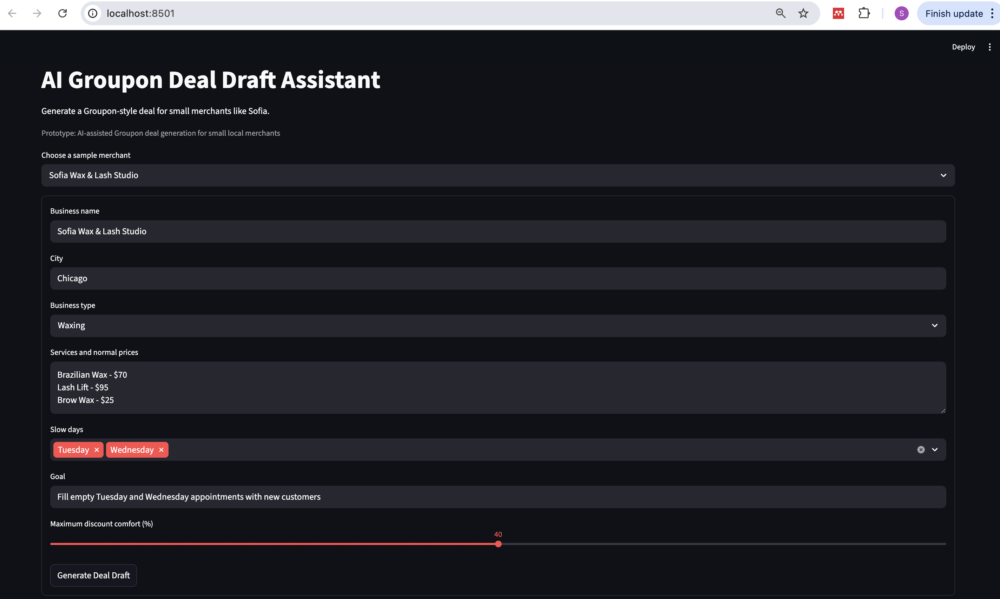
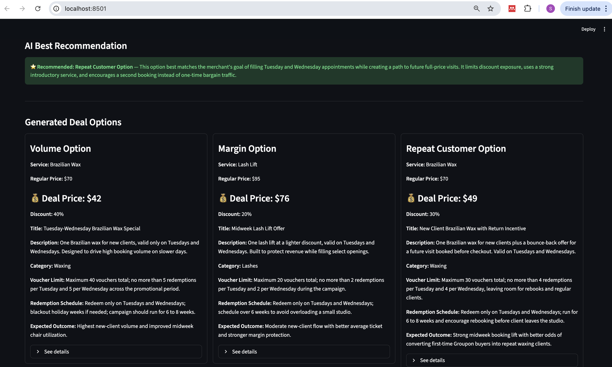

# AI Groupon Deal Draft Assistant

Demo: AI-assisted Groupon deal generation for small local merchants

Prototype: **AI-assisted Groupon deal generation for small local merchants**

This prototype demonstrates how AI can reduce friction in Groupon’s merchant onboarding flow by automatically generating **publish-ready deal drafts from minimal merchant input**.

The assistant generates:

* multiple deal strategies
* operational constraints (voucher limits, redemption schedules)
* business rationale
* risk flags
* a recommended best option

The goal is to help merchants launch their first deal **quickly and confidently**, instead of abandoning the setup process.

---

# Product Demo

## Merchant Input

Merchants provide a small amount of information about their business.

This includes:

* business type
* services and prices
* slow days
* marketing goal
* discount comfort level

The assistant uses this input to generate realistic promotion strategies.

---

## AI Generated Deal Strategies

The assistant generates **three strategic deal options**:

**Volume Strategy**

* maximizes new customer acquisition

**Margin Strategy**

* protects revenue per appointment

**Repeat Customer Strategy**

* encourages long-term customer retention

The AI also highlights a **recommended option** based on the merchant’s goal.

---

# Background

Many small business owners are not experienced marketers. When creating a Groupon deal they must decide:

* which service to promote
* what discount to offer
* how many vouchers to sell
* how to write the deal description
* how to protect margins and avoid overselling capacity

This creates significant **decision friction**.

### Example Merchant

**Sofia — Waxing & Lash Studio Owner**

* 2-chair studio
* loyal customer base
* slow Tuesday and Wednesday schedule
* limited time to experiment with marketing tools

When Sofia reaches Groupon’s deal creation form, she must make many complex decisions quickly.

Many merchants **drop off before publishing a deal**.

---

# Job To Be Done

“Help me get new customers in my chair this week — without me having to figure out how Groupon works.”

---

# Product Hypothesis

AI can reduce merchant drop-off by:

1. generating a **complete deal draft**
2. offering **multiple strategic options**
3. recommending the **best option for the merchant’s goal**
4. providing **operational guardrails** such as voucher limits and redemption schedules

Instead of filling out a complex form, merchants start from an **AI-generated proposal**.

---

# Prototype Overview

This Streamlit prototype demonstrates an **AI Deal Draft Assistant**.

Workflow:

1. Merchant enters minimal information
2. AI generates three deal strategies
3. AI recommends the best option
4. Merchant reviews options before publishing

Generated outputs include:

* recommended service
* pricing and discount
* deal title and description
* fine print
* category
* voucher limits
* redemption schedule
* expected outcome
* business rationale
* risk flags

---

# Example Output

Example merchant: **Fresh Face Studio**

Goal: Fill slow Wednesday and Thursday appointments while protecting margin.

The assistant generates:

### Option 1 — Volume Strategy

* lower-ticket express facial
* higher voucher limit
* designed to maximize lead volume

### Option 2 — Margin Strategy

* premium facial
* moderate discount
* protects profitability

### Option 3 — Repeat Customer Strategy

* signature facial with controlled discount
* encourages ongoing facial routines

The system then recommends the **best option** based on the merchant’s stated goal.

---

# Primary Metric

**Deal Creation Completion Rate**

Definition
Percentage of merchants who start deal creation and successfully publish a deal.

Baseline assumption:

40%

Expected improvement with AI assistant:

55%

Reasoning:

* reduces decision complexity
* shortens time to first draft
* increases merchant confidence

---

# Secondary Metrics

## Time to First Draft

Baseline: ~15 minutes
Target: **< 3 minutes**

---

## Deal Edit Burden

Average number of fields merchants manually edit after AI generation.

Lower edits indicate higher AI usefulness.

---

## Merchant Satisfaction

Qualitative feedback on:

* clarity of options
* perceived usefulness
* confidence to publish

---

# Sample Merchant Scenarios

The prototype includes several merchant profiles to test generalization.

## Sofia Wax & Lash Studio

Category: Waxing
Goal: Fill slow Tuesday/Wednesday appointments
Max discount: 40%

Services:

* Brazilian Wax — $70
* Lash Lift — $95
* Brow Wax — $25

---

## Glow Nail Bar

Category: Nails
Goal: Bring in weekday customers
Max discount: 35%

Services:

* Gel Manicure — $45
* Pedicure — $55
* Gel Mani + Pedi — $90

---

## Fresh Face Studio

Category: Facials
Goal: Fill unused appointments while protecting margin
Max discount: 30%

Services:

* Express Facial — $60
* Signature Facial — $110
* Acne Facial — $125

---

# Lightweight Evaluation

The assistant was tested across multiple merchant types to evaluate:

* diversity of deal strategies
* realism of voucher limits
* clarity of rationale
* usefulness of risk flags

### Observations

**Sofia Wax & Lash Studio**

* strong differentiation between volume vs retention strategy
* realistic operational limits
* appropriate service selection

**Glow Nail Bar**

* lower-ticket services shift strategy toward volume offers
* voucher limits adjust appropriately for shorter services

**Fresh Face Studio**

* premium services encourage margin-protection strategies
* discount depth adjusted downward

---

# System Architecture

Merchant Input
↓
Prompt Construction
↓
OpenAI Model (Deal Strategy Generation)
↓
Structured JSON Response
↓
Streamlit UI Rendering

Core components:

* Streamlit UI
* OpenAI Responses API
* prompt-based strategy generation
* structured JSON output parsing

---

# Tech Stack

* Python
* Streamlit
* OpenAI API
* python-dotenv

---

# Project Structure

groupon-ai-prototype

app.py
README.md
requirements.txt
.env
screenshots/

---

# How to Run

Create virtual environment

python -m venv .venv

Activate environment

source .venv/bin/activate

Install dependencies

pip install -r requirements.txt

Add OpenAI API key to `.env`

OPENAI_API_KEY=your_api_key_here

Run the application

streamlit run app.py

---

# What Was Intentionally Not Built

This prototype focuses only on the **highest-impact friction point: deal creation**.

Excluded features:

* merchant onboarding
* payments and billing
* image generation
* merchant analytics
* booking integrations
* marketplace ranking systems

These are downstream concerns once a merchant successfully creates a deal.

---

# Limitations

This prototype uses heuristic reasoning rather than real marketplace data.

Future improvements could include:

* historical deal performance data
* city-level discount benchmarks
* merchant capacity modeling
* AI price optimization
* integration with merchant calendars

---

# Future Improvements

Potential production enhancements:

* AI pricing recommendations based on category performance
* automatic voucher limit calculation from appointment duration
* merchant capacity modeling
* AI-generated deal images
* experiment framework for A/B testing deal structures

---

# Conclusion

This prototype demonstrates how AI can reduce merchant friction by transforming a complex deal-creation workflow into a **guided AI-assisted experience**.

By generating strategic deal options and recommending the best one, the assistant helps small merchants like Sofia quickly launch effective promotions without needing deep marketing expertise.

---
